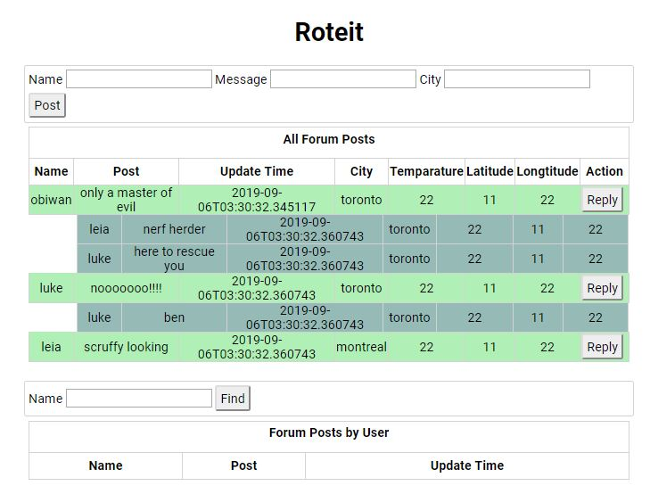

# Roteit
A forum where you can post and reply to comments. Location/weather is captured along with comments.

A REST API implemented with python flask framework 


## Install libraries

TODO: add other libs that are needed
```
pip install Flask-SQLAlchemy flask-marshmallow marshmallow-sqlalchemy marshmallow
```

#### downgrade SQLALchemy 
```
pip show Flask-SQLAlchemy
pip uninstall Flask-SQLAlchemy
pip install Flask-SQLAlchemy==2.1
pip show Flask-SQLAlchemy
```

#### weather API library
```
pip install pyowm
```
Documentation - https://pyowm.readthedocs.io/en/latest/usage-examples-v2/weather-api-usage-examples.html

## Testing

runtests.bat - execute Cypress test

(Unit tests using pytest were removed in favour of Cypress - Reason: since we are using SQLAlchemy for ORM, Integration tests make more sense)
